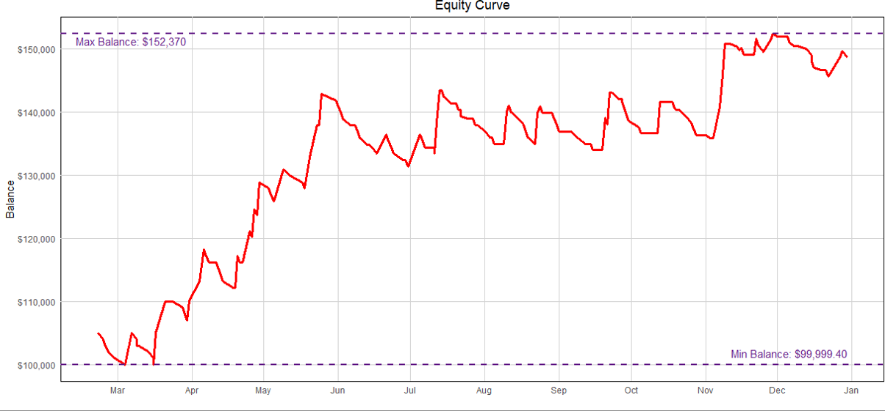
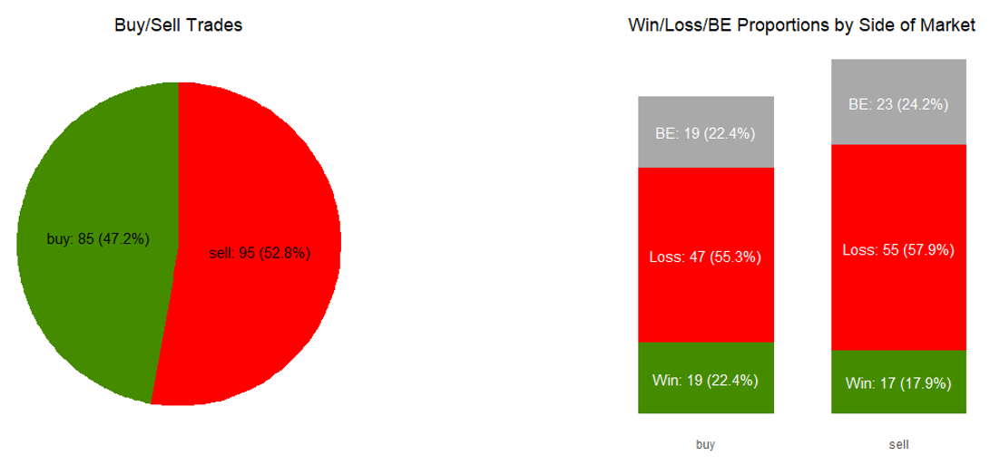
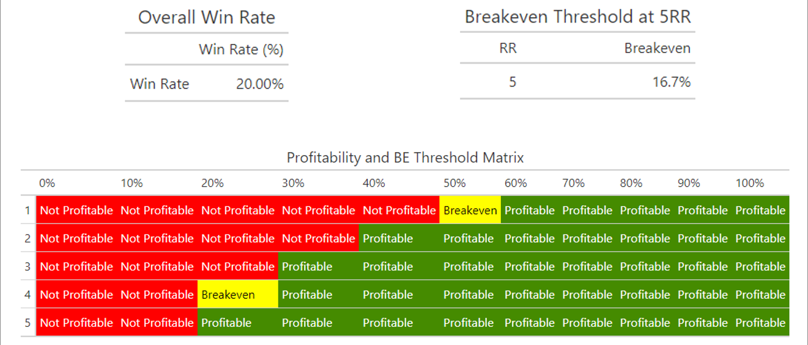
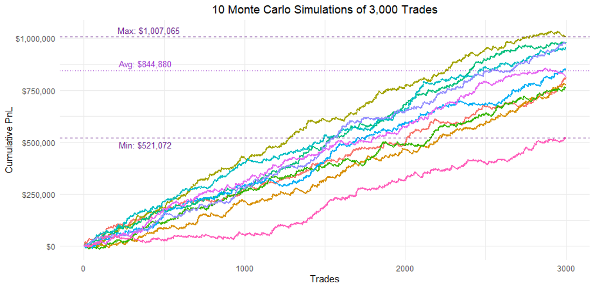

# Trading Strategy Performance Analysis (NASDAQ-100)

## Overview
Analyzed a 10-month backtest of a NASDAQ-100 trading strategy using a self-collected dataset to evaluate performance, risk, and profitability.

## Tools
R, Data Analysis, Statistical Evaluation, Monte Carlo Simulation

## Key Analysis
- Built and cleaned a dataset of historical trades (entry, stop loss, take profit, P&L)
- Evaluated key metrics: win rate, risk-reward ratio (~4.0), and trade duration (~66 min)
- Analyzed performance across trade direction (buy vs sell) and weekdays
- Simulated future performance using Monte Carlo simulation

## Key Insights
- Strategy achieves high risk-reward (~4:1) with low win rate (~20–22%)
- Buy-side trades show stronger performance than sell-side
- Performance weakens on Thursdays and Fridays
- Equity curve shows overall upward trend with controlled drawdowns

## Business Impact
Demonstrates ability to:
- Work with self-collected real-world data
- Evaluate performance and risk using quantitative metrics
- Apply simulation techniques to assess uncertainty and robustness

## Key Visuals

### Equity Curve

### Win/Loss Proportions

### Win Rate and Breakeven Threshold Analysis

### Monte Carlo Simulation

